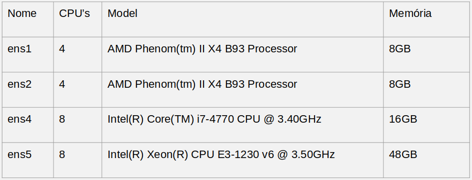
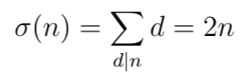

```{r setup, include=FALSE}
knitr::opts_chunk$set(echo = TRUE, out.width='70%', fig.align="center")
```

# Descrição da atividade

O objetivo desta atividade é aplicar a técnica de projeto de experimentos. A atividade é dividida em duas partes:

1. Definição de projetos de experimentos
2. ANOVA fatorial

Algumas recomendações:

- Se você não estiver habituado com R Markdown, acostume-se a processar com frequência o  documento, usando o botão **Knit**. Isso permitirá que eventuais erros no documento ou no código R sejam identificados rapidamente, pouco depois de terem sido cometidos, o que facilitará sua correção. Na verdade, é uma boa ideia você fazer isso **agora**, para garantir que seu ambiente esteja configurado corretamente. Se você receber uma mensagem de erro do tipo _Error in library(foo)_, isso significa que o pacote `foo` não está instalado. Para instalar um pacote, execute o comando `install.packages("foo")` no Console, ou clique em _Tools_ -> _Install Packages_.
- Após concluir a atividade, você deverá submeter no Moodle um arquivo ZIP contendo:
    * o arquivo fonte .Rmd;
    * a saída processada (PDF ou HTML) do arquivo .Rmd;
    * arquivos necessários para o processamento do .Rmd.
    
Uma forma simples de enviar uma submissão correta é exportar o seu projeto no RStudio Cloud e submeter o arquivo ZIP gerado.

# Configuração 

Nesta atividade, nenhuma configuração é necessária por padrão, mas você pode usar o bloco abaixo para incluir o que julgar necessário.

```{r config}
# insira seus comandos de configuração aqui
```

# Parte 1: Definição de Projetos de Experimentos

Nesta parte você irá considerar como aplicar o projeto de experimentos na análise de desempenho de um sistema ou aplicação de seu interesse.

1. Descreva brevemente o sistema.

2. Identifique uma ou mais métricas de desempenho que podem ser usadas como variável de resposta. O tempo de execução/resposta pode ser uma das métricas, mas não a única. 

3. Identifique pelo menos 3 fatores que podem influenciar o desempenho do sistema. Para cada fator, descreva os níveis que você adotaria. Justifique brevemente a escolha dos fatores e dos níveis; não precisa discorrer sobre o assunto, apenas explicar porque você supõe que os fatores podem influenciar no desempenho e porque os níveis escolhidos são razoáveis.

4. Calcule o número de experimentos de um projeto fatorial completo usando os fatores e níveis descritos no item 3. Não se esqueça de considerar as replicações (defina quantas replicações seriam realizadas).
5. Partindo dos fatores e níveis definidos no item 3, monte um projeto $2^k$ para esse experimento, especificando quais fatores e níveis seriam usados no projeto. Calcule o número de experimentos do projeto, considerando o mesmo número de replicações do item 4.
6. Suponha que a análise dos resultados do projeto $2^k$ definido no item 5 revele que o fator com mais níveis proposto no item 3 não é estatisticamente significativo. Calcule quantos experimentos adicionais precisarão ser realizados para um projeto fatorial completo com os fatores significativos (considere replicações).

_Respostas aqui_

### 1 
- Uma aplicação em C utilizando OpenMp, para verificação de números perfeitos. 

- Números perfeitos são números inteiros positivos em que a soma de seus divisores positivos excluindo o próprio número, é igual ao seu valor. Exemplos de Números Perfeitos: 
  - O número 6 é um número perfeito porque a soma de seus divisores são iguais ao número seis. (3 + 2 + 1) = 6.
  - 28: (14 + 7 + 4 + 2 + 1) = 28
  - 496
  - 8128
  - 33550336
  - 8589869056
  - 137438691328
  - 2305843008139952128

- Para verificar se o número é perfeito, foi utilizado “Brute force”: Dividir números antecessores um a um para verificar seus possíveis divisores, realizar a soma desses divisores e verificar se o resultado da soma é igual ao número, definindo assim o número como perfeito.

- Hardware utilizado nos testes ens5 8 CPU's Intel(R) Xeon(R) CPU @ 3.50GHz 48 GB Memory
<!--  -->

#### Open MP
A execução com OpenMP utilizou os seguintes alcances de números para verificação de números perfeitos: 0-100000, 0-300000 e 0-600000. Além das seguintes quantidades de threads: 1, 2, 4, 6 e 8, para cada alcance, e por fim foram testados os seguintes schedules: static, dynamic e guided para cada alcance e número de threads definidas. Todas as execuções foram testadas na mesma maquina: ens5.

#### MPI
A execução com o MPI utilizou os seguintes alcances de números para verificação de números perfeitos: 0-100000, 0-300000 e 0-600000. Além das seguintes quantidades de threads: 1, 2, 4, 8. Todas as execuções foram testadas na mesma maquina: ens5.
<!-- 
#### MPI  
- A execução com o MPI utilizou os seguintes alcances de números para verificação de números perfeitos: 0-100000, 0-300000 e 0-600000. Além das seguintes quantidades de threads: 1, 2, 4, 8, 16 e 24 para cada alcance e número de threads definidas. Para a coleta de dados dos gráficos foi realizado apenas uma execução.
- O hardware utilizado no MPI teve diferenças de acordo com o número de threads, o hardware das máquinas está definido na Tabela acima de hardware. Para os testes com as threads 1, 2, 4, 8 foi utilizado a máquina ens5, já para 16threads foi utilizado as máquinas ens5 e ens4, para o teste com 24 threads foram utilizadas todas as máquinas apresentadas na Tabela acima: ens1, ens2, ens4 e ens5.
 --> 
 
<!-- 
A sua definição matemática segue pela seguinte equação:
# 
 --> 
 
### 2
- "seconds": Tempo de execução  
- "memory": Quantidade de memoria utilizada em kb   <!-- o modo de paralelismo utilizado "schedule" ["static", "dynamic", "guided", "auto_open_mp", "auto_mpi"] "type" ["OpenMp", "MPI"] --> 
 
### 3
- "limit": Alcance dos números a serem verificados se são perfeitos, como 100000, o sistema irá pesquisar todos os números de 1 até 100000 a fim de encontrar os números perfeitos nesse intervalo [100000, 300000, 600000]
- "threads": Quantidade de threads utilizadas para realizar o paralelismo [1, 2, 4, 6, 8]
- "schedule": Modo de paralelismo utilizado ["static", "dynamic", "guided", "auto_open_mp", "auto_mpi"] 
 

### 4
- ("limit") 3 x ("threads") 5 x ("schedule") 5 = `r (rep = 3 * 5 * 5)` experimentos sem replicação, com 5 replicações teríamos `r rep * 5` experimentos

### 5
- "limit": [300000, 600000]
- "threads": [2, 8]
- "schedule": ["auto_open_mp", "auto_mpi"]
-  `r (repq = 2 ** 3)` experimentos sem replicaçao, com 5 replicaçoes teriamos `r repq * 5` experimentos

### 6
- Tanto as threads quanto o schedule possuem 5 níveis, removendo apenas um deles, ficaria com ("limit") 3 x ("threads" ou "schedule") 5 = `r (rep6 = 3 * 5)` experimentos sem replicação, com 5 replicações teríamos `r rep6 * 5 ` experimentos, descontando 2^2=`r (repq65 = 2 ** 2)` experimentos já realizados no item 5, ficam `r (rep6_remove5 = rep6 - repq65)` experimentos sem replicação, e `r rep6_remove5 * 5` experimentos com 5 replicações
  
# Parte 2: ANOVA Fatorial

Nesta parte da atividade você irá usar ANOVA fatorial para analisar os resultados de um conjunto de experimentos. Esses experimentos tinham por objetivo avaliar o impacto de processador e memória no tempo de execução de dois _benchmarks_ A e B. Os fatores e níveis considerados foram:

fator          | níveis
---------------|-------
CPU            | AMD, Intel
no. de núcleos | 4, 8
memória        | 2 GB, 4 GB, 8 GB

Foi usado um projeto de experimentos fatorial completo, com 5 replicações de cada experimento. Os dados coletados estão contidos no arquivo `doe-benchmarks.dat`, que contém as seguintes colunas:

- `benchmark`: qual o _benchmark_ (A ou B);
- `cpu`: tipo de CPU;
- `cores`: quantidade de núcleos;
- `mem`: quantidade de memória;
- `tempo`: tempo de execução do _benchmark_.

Com base nesses dados, analise separadamente cada _benchmark_, seguindo os passos abaixo:

1. Analise graficamente como cada fator influencia o tempo de exemplo de execução.
2. Faça uma ANOVA fatorial, e identifique os fatores e interações estatisticamente significativos.
3. Faça a alocação de variação, descrevendo qual a porcentagem de variação explicada pelos fatores e interações significativos e pelos resíduos.
4. Use o teste de Tukey para verificar quais são as diferenças significativas entre os níveis dos fatores/interações significativos.
5. Faça o diagnóstico dos resíduos da ANOVA.
6. Verifique a premissa de homogeneidade de variâncias.
7. Descreva como os fatores significativos influenciam o tempo de execução. Leve em consideração as interações, se houver. (Sugestão: use gráficos de interação para visualização.)

**ATENÇÂO**: Os passos 1 a 7 deverão ser realizados duas vezes, uma para o _benchmark_ A e outra para o _benchmark_ B.

```{r}
benchmarks <- read.table("doe-benchmarks.dat", head=T)
str(benchmarks)
benchmarks.split <- split(benchmarks, factor(benchmarks$benchmark))
benchmarks.split$A$cores = as.factor(benchmarks.split$A$cores)
benchmarks.split$B$cores = as.factor(benchmarks.split$B$cores)
str(benchmarks.split$A)
str(benchmarks.split$B)

with(benchmarks.split$A, interaction.plot(cpu, cores, tempo, col = c("red", "blue")))
with(benchmarks.split$A, interaction.plot(mem, cores, tempo, col = c("red", "blue")))
with(benchmarks.split$A, interaction.plot(cpu, mem, tempo, col = c("red", "blue")))

(benchmarks.split$A.aov = aov(tempo ~ cpu * cores * mem, benchmarks.split$A))
summary(benchmarks.split$A.aov)


plot(benchmarks.split$A.aov)

(SS = anova(benchmarks.split$A.aov)['Sum Sq'])
SST = sum(SS)
(benchmarks.split$A.pv = round(100*SS/SST, 2))


(benchmarks.split$A.flig = fligner.test(tempo ~ interaction(cpu, cores, mem), benchmarks.split$A))
# p-value > alfa (assumindo 95% de nivel de confiança), então é válido


TukeyHSD(benchmarks.split$A.aov)

# TESTE BENCHMARK B

with(benchmarks.split$B, interaction.plot(cpu, cores, tempo, col = c("red", "blue")))
with(benchmarks.split$B, interaction.plot(mem, cores, tempo, col = c("red", "blue")))
with(benchmarks.split$B, interaction.plot(cpu, mem, tempo, col = c("red", "blue")))

(benchmarks.split$B.aov = aov(tempo ~ cpu * cores * mem, benchmarks.split$B))
summary(benchmarks.split$B.aov)


plot(benchmarks.split$B.aov)

(SS = anova(benchmarks.split$B.aov)['Sum Sq'])
SST = sum(SS)
(benchmarks.split$B.pv = round(100*SS/SST, 2))


(benchmarks.split$B.flig = fligner.test(tempo ~ interaction(cpu, cores, mem), benchmarks.split$B))
# p-value > alfa (assumindo 95% de nivel de confiança), então é válido


TukeyHSD(benchmarks.split$B.aov)
```

## Análise para o _benchmark_ A
- 1: Analisando graficamente o benchmark A, é possível observar sobreposição com o gráfico de interação dos dados "cpu, cores, tempo" e "mem, cores, tempo" dos cores, apresentando que os cores: quantidade de núcles não são significativos para o tempo de execução. Já para o gráfico "cpu, mem, tempo" aparenta que a memoria é um fator significativo, assim como o tipo de "cpu" que aparenta ser significativo.

- 2: Para 95% de nível de confiança, a anova indica que os fatores "cpu" e "mem" são significativos, já para os demais fatores e interações, os valores são estatisticamente não significativos.


- 3: A alocação de variação apresenta `r benchmarks.split$A.pv$'Sum Sq'[1]`% para o fator cpu e `r benchmarks.split$A.pv$'Sum Sq'[3]`% para a memória, os demais fatores e interações possuem valor insignificantes. Além disso, os resíduos é  `r benchmarks.split$A.pv$'Sum Sq'[8]`, próximo a zero.


- 4: Para os fatores significativos "cpu" e "mem" e a sua interaçao ["cpu", "mem"] todos passam no teste de Tukey, pois o alfa 0.05 é menor que o valor p. Para as interações e fatores, apresentam no mínimo um valor que não é significativos.

<!--
 Intel:8:2 GB-Intel:4:2 GB  -0.096  -1.0622238   0.8702238 0.9999999
 AMD:8:4 GB-AMD:4:4 GB       0.072  -0.8942238   1.0382238 1.0000000
 Intel:8:4 GB-Intel:4:4 GB   0.114  -0.8522238   1.0802238 0.9999996
 AMD:8:8 GB-AMD:4:8 GB      -0.104  -1.0702238   0.8622238 0.9999998
 Intel:8:8 GB-Intel:4:8 GB  -0.050  -1.0162238   0.9162238 1.0000000
 -->
 

- 5: Os resíduos estão próximos ao valor 0 o que é bom, não possuem tendência, e tem poucos pontos fora que podem atrapalhar a homogeneidade de variâncias. O teste de fligner apresenta um valor p de `r round(benchmarks.split$A.flig$p.value, 2)` que é suficiente para um nível de confiança de 95%, aprovando o modelo.

- 6: As variâncias devem ser aproximadamente iguais, e é aprovado pelo teste de filgner, que apresenta um valor p de `r round(benchmarks.split$A.flig$p.value, 2)`, o que seria válido até para um nível de confiança de 20%, aprovando o modelo utilizando 95% de confiança.

- 7: O desempenho é bem influenciado pela memória, então quanto maior a memória melhor para o programa, e que o tipo de cpu favorece o tipo da Intel.
```{r}
with(benchmarks.split$A, interaction.plot(cpu, mem, tempo, col = c("red", "blue")))
```


## Análise para o _benchmark_ B
- 1: Analisando graficamente o benchmark B, é possível observar que dessa vez os cores modificam os gráficos, talvez não seja estatisticamente significativo, mas não existe mais sobreposição com o gráfico de interação dos dados "cpu, cores, tempo" e "mem, cores, tempo" para os cores. Para o fator "mem", novamente acredito ser bastante significante para o tempo de execução, e o tipo de cpu apresenta a maior variância para 2 GB de "mem" e parece inverter do benchmark A e favorecer o tipo de cpu "AMD".

- 2: Para 95% de nível de confiança, a anova indica que os fatores "cpu" e "mem" e a interaçao entre eles ["cpu", "mem"] são significativos, já para os demais fatores e interações, os valores são estatisticamente não significativos.

- 3: A alocação de variação apresenta `r benchmarks.split$B.pv$'Sum Sq'[1]`% para o fator cpu e `r benchmarks.split$B.pv$'Sum Sq'[3]`% para a mem (a memória é a que mais contribui para a alocação de variação), para a interação entre eles  ["cpu", "mem"] apresenta `r benchmarks.split$B.pv$'Sum Sq'[5]`%, os demais fatores e interações possuem valores próximos a zero. Dessa vez, os resíduos são maiores que o benchmark A, apresentando `r benchmarks.split$B.pv$'Sum Sq'[8]` de resíduo, mas ainda parece bom.


- 4: Para os fatores significativos "cpu" e "mem" todos passam no teste de Tukey, pois o alfa 0.05 é menor que o valor p. Já a sua interação ["cpu", "mem"] contem 2 valores que não passam no teste de Tukey, significando que para os tipos de "cpu" as "mem" 4 GB e 8 GB não possuem diferença estatística.
<!--
Intel:4 GB-AMD:4 GB     1.017  -0.3108353   2.3448353 0.2250650
Intel:8 GB-AMD:8 GB    -0.705  -2.0328353   0.6228353 0.6180355
-->

- 5: Os resíduos não possuem tendência, mas fica próximo a 0, e tem alguns pontos distantes que podem atrapalhar a homogeneidade de variâncias. O teste de fligner apresenta um valor p de `r round(benchmarks.split$B.flig$p.value, 2)` que é suficiente para um nível de confiança de 95%, aprovando o modelo.

- 6: As variâncias devem ser aproximadamente iguais, e é aprovado pelo teste de filgner, que apresenta um valor p de `r round(benchmarks.split$B.flig$p.value, 2)`, o que seria válido até para um nível de confiança de 5%, aprovando o modelo utilizando 95% de confiança.

- 7: O desempenho é bem influenciado pela memória, mas nesse benchmark para os casos de 4 GB e 8 GB o tempo de execução não apresenta grandes diferenças. O tipo de cpu pode se inverter, mas é difícil dizer qual se favorece, pois a diferença do tempo de execução é pouca entre os dados, mas se fosse obrigado a escolher um, escolheira o AMD, pois mesmo que para 4 e 8 GB não exista diferença significativa, para 2 GB é possível observar que a AMD ganha, tendo a média próxima a 30 e a Intel passando dos 34.
```{r}
with(benchmarks.split$B, interaction.plot(cpu, mem, tempo, col = c("red", "blue")))
with(benchmarks.split$B, interaction.plot(cpu, cores, tempo, col = c("red", "blue")))
```


