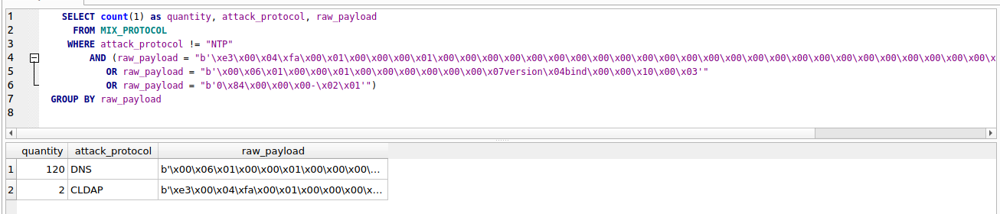

```{r setup, include=FALSE}
knitr::opts_chunk$set(echo = TRUE)
```

```{r echo=FALSE}
library('RSQLite')
library('ggplot2')
library(DBI)
options("scipen"=100, "digits"=4)
library(dplyr)
library(tibble)
library(viridis)
library(lubridate)
library(blob)
# library("dplyr.teradata")
```

## R Markdown
NT1. NTP: incidência de monlist

Resultados esperados:
Historicamente os ataques DRDoS com NTP fazem uso do comando monlist. Analisar a porcentagem de monlist por período, para ver se ela se mantém consistentemente acima de 99% ou houve alteração

Resultados esperados:

- tabela/gráfico de barras com a %monlist por período 
```{r fetch_data}
db <- dbConnect(RSQLite::SQLite(), dbname="../db/database-2022-05-11/mix_protocol.sqlite")

data_unfetch <-dbSendQuery(db, "
  SELECT *, CAST(CAST(year AS text) || CAST(period AS text) as integer) as year_period
    FROM NTP_ANALYSIS
")
data <- fetch(data_unfetch)

data_npt_payload_types_unfetch <-dbSendQuery(db, "
  SELECT id, quantity, SUBSTR(payload,0,25) AS payload_limit
    FROM NTP_PAYLOAD_TYPES
")
data_ntp_payload_types <- fetch(data_npt_payload_types_unfetch)

dbDisconnect(db)
```

- Calculado a porcentagem de "ntp_type" por período
  - Existem apenas dois tipos em "ntp_type" = {"Monlist", "Outros"}
  - Além disso o "ntp_type" é definido da seguinte forma 
  ```python

def get_ntp_type(ntp_payload):

  if len(ntp_payload) <= 3:
    return "Other"

  if (monlist_byte0[0] == ntp_payload[0] and monlist_byte3[0] == ntp_payload[3]):
    return "Monlist"
    
  return "Other"
  ```
  
- Agrupamento realizado:
```{r}

data['tempo_final_cast'] = as.POSIXct(data[['tempo_final']], format = "%Y-%m-%d %H:%M:%S")
data['tempo_inicio_cast'] = as.POSIXct(data[['tempo_inicio']], format = "%Y-%m-%d %H:%M:%S")

data_grouped_period_ntp_type = data %>%
  mutate(year_period = as.factor(year_period)) %>%
  group_by(year_period, ntp_type) %>%
  summarise(sum_requests_per_attack = sum(requests_per_attack), number_of_attacks = n()) 

data_grouped_period_ntp_type_percentage = data_grouped_period_ntp_type %>%
  group_by(year_period) %>%
  summarise(ntp_type = ntp_type, number_of_attacks = number_of_attacks,
            sum_period_number_of_attacks = sum(number_of_attacks), 
            sum_period_requests_per_attack = sum(sum_requests_per_attack),
            sum_requests_per_attack = sum_requests_per_attack) %>%
  mutate(number_of_attacks_percentage = (number_of_attacks / sum_period_number_of_attacks) * 100, 
         number_of_requests_percentage = (sum_requests_per_attack / sum_period_requests_per_attack) * 100)


data_grouped_period_ntp_type_percentage %>%
  select(year_period, ntp_type, number_of_attacks_percentage, number_of_attacks) %>%
  print(n=14)

```
- Isso significa que no ultimo trimestre de 2020 ("year_period" = 20204) 99% dos ataques realizados foram monlist, e 0.3% outros tipos

- Gráfico de barras empilhadas apresentando a porcentagem da quantidade de ataques em cada "ntp_type" por período
```{r fig.width = 12}
data_grouped_period_ntp_type_percentage %>% 
  ggplot( aes(x=year_period, y=number_of_attacks_percentage, fill=ntp_type)) +
    geom_bar(stat="identity", width = 0.5) +
    geom_text(aes(label = paste(round(number_of_attacks_percentage, 2), "%")), 
              position = position_stack(vjust = 0.6)) +
    scale_fill_viridis(discrete=TRUE, option="inferno", begin = 0.8, end = 0.4, direction = -1) +
    ylab("Porcentagem da quantidade de ataques") +
    xlab("Período (Trimestre)") + 
    ggtitle("NTP - Porcentagem de ataques por trimestre e por \"ntp_type\" com barras empilhadas")
```

- Gráfico de barras empilhadas apresentando a porcentagem da quantidade de ataques em cada "ntp_type" por período
```{r fig.width = 12}
data_grouped_period_ntp_type_percentage %>% 
  ggplot( aes(x=ntp_type, y=number_of_attacks_percentage, fill=ntp_type)) +
    #geom_bar(stat="identity", width = 0.5, prosition = "dodge") +
    geom_bar(stat="identity", position="dodge") + 
    geom_text(aes(label = paste(round(number_of_attacks_percentage, 2), "%"),  vjust = -0.25)) +
    scale_fill_viridis(discrete=TRUE, option="inferno", begin = 0.8, end = 0.4, direction = -1) +
    facet_grid(~year_period) +
    ylab("Porcentagem da quantidade de ataques") +
    xlab("Período (Trimestre)") + 
    ggtitle("NTP - Porcentagem de ataques por trimestre")
```

- Gráfico de barras apresentando a porcentagem da quantidade de requisições em cada "ntp_type" por período
```{r fig.width = 12}
data_grouped_period_ntp_type_percentage %>% 
  ggplot( aes(x=ntp_type, y=number_of_requests_percentage, fill=ntp_type)) +
    #geom_bar(stat="identity", width = 0.5, prosition = "dodge") +
    geom_bar(stat="identity", position="dodge") + 
    geom_text(aes(label = paste(round(number_of_requests_percentage, 2), "%"),  vjust = -0.25)) +
    scale_fill_viridis(discrete=TRUE, option="inferno", begin = 0.8, end = 0.4, direction = -1) +
    facet_grid(~year_period) +
    ylab("Porcentagem da quantidade de requisições") +
    xlab("Período (Trimestre)") + 
    ggtitle("NTP - Porcentagem de requisições por trimestre por \"ntp_type\"")
```


- No trimestre de 2021.2 existe uma grande quantidade de ataques ntp que não são monlist, o que surge uma dúvida do que pode ser esses registros?
```{r}
data %>%
  filter(year_period == 20212 & ntp_type == 'outros') %>%
  group_by(raw_payload) %>%
  summarise(quantity = n(), inicio = min(tempo_inicio), fim = max(tempo_final)) %>%
  mutate(raw_payload = substr(raw_payload, 0, 100)) %>%
  select(quantity, inicio, fim, raw_payload)

```
- Um payload aparece 178x nesses dados de 2021.2 (b'0\\x84\\x00\\x00\\x00-\\x02\\x01')
- Tentei decodificar esses payloads [codebeautify](https://codebeautify.org/utf8-decode?), porém sem sucesso

- O payload que aparece 2x b'\\xe3\\x00\\x04\\xfa\\x00\\x01\\x00\\x00\\x00\\x01\\x00\\x00\\x00\\x00\\x00\\x00\\x00\\x00\\x00\\x00\\x00\\x00\\x00\\x00\\x00\\x00\\x00\\x00\\x00\\x00\\x00\\x00\\x00\\x00\\x00\\x00\\x00\\x00\\x00\\x00\\xc5O#Kq\\xb1R\\xf3'	é também utilizado em CLDAP
- O payload que aparece 1x b'\\x00\\x06\\x01\\x00\\x00\\x01\\x00\\x00\\x00\\x00\\x00\\x00\\x07version\\x04bind\\x00\\x00\\x10\\x00\\x03' é também utilizado em DNS 
- Ja o payload que não é monlist e aparece 178x não existe em nenhum outro protocolo



```{r}
ntp_payload_types = data_ntp_payload_types %>%
  mutate(payload_str = toString(payload_limit)) %>%
  arrange(desc(quantity)) %>%
  select('quantity', 'payload_limit', 'id') 

ntp_payload_types_quantity_percentage = ntp_payload_types %>%
  mutate(sum_quantity = sum(quantity)) %>%
  mutate(quantity_percentage = (quantity / sum_quantity) * 100)

ntp_payload_types_quantity_percentage %>%
  #filter(quantity_percentage > 0.10) %>%
  select('quantity', 'quantity_percentage', 'payload_limit') %>%
  head(15)
  
# ntp_payload_types_quantity_percentage %>%
#  select('quantity_percentage', 'payload_limit') %>%
#  ggplot( aes(x=payload_limit, y=quantity_percentage)) + 
#  geom_bar(stat="identity", position="dodge")
```
